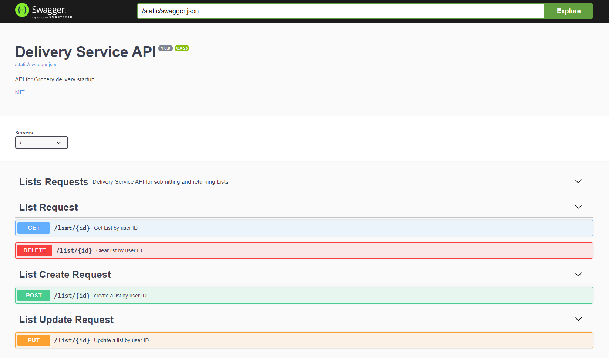
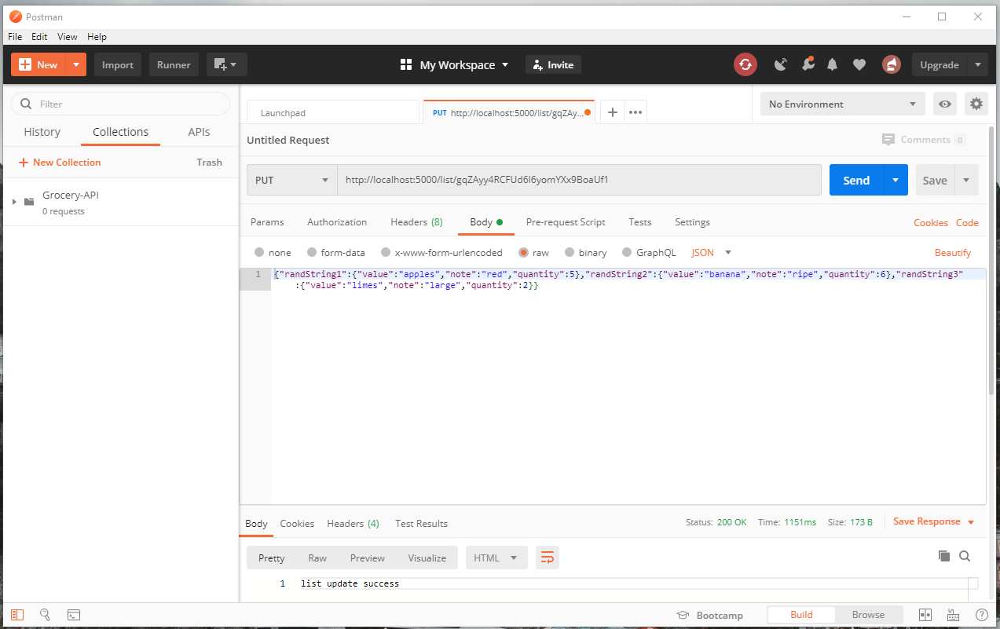

## Delivery Service API

Seans Python3 Flask Rest Boilerplate

### To Setup and Start

```bash
add delivery-biz-firebase-adminsdk-f8kue-afc933be68.json to project ( in top level )
pip install -r requirements.txt
python app.py
```

## Docker

docker-compose up
 use http://127.0.0.1/swagger/

### Base URL

for Docker = "http://127.0.0.1"
for local = "http://localhost:5000"

## Swagger UI

{Base URL}/swagger/


### Test user id
gqZAyy4RCFUd6I6yomYXx9BoaUf1

### Example JSON formatted List

{"randString1":{"value":"apples","note":"red","quantity":5},"randString2":{"value":"banana","note":"ripe","quantity":6},"randString3":{"value":"limes","note":"large","quantity":2}}

### Example in postman


## Unit Test with Nose

```bash
nosetests --verbosity=2
or  for windows
python -m nose --verbose
```

### Test Output

```bash
Test getting a list ... ok
Test getting a non existent list ... ok
Test adding a new list ... ok
Test update a list ... ok
Test updating a list with no user id ... ok
Test clearing list ... ok
Test clearing list fail ... ok

----------------------------------------------------------------------
Ran 7 tests in 15.013s

OK
```

###

Hosted via Docker-compose and Nginx
http://127.0.0.1/swagger/
